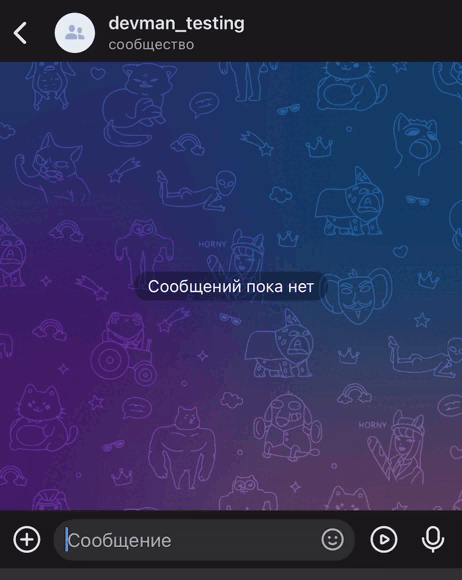

# dialog_flow

Чат боты для [Telegram](https://t.me/DevmanDialogFlowBot) и [VK](https://vk.com/club218507276) с интеграцией [Dialogflow](https://dialogflow.cloud.google.com).

[Dialogflow](https://dialogflow.cloud.google.com) - это платформа искусственного интеллекта (AI) от компании [Google](https://console.cloud.google.com/), которая позволяет разработчикам создавать и настраивать чат-боты, голосовых ассистентов, системы автоматизации общения с клиентами и другие приложения с возможностью распознавания естественного языка.



[Пообщаться с telegram_chat_bot](https://t.me/DevmanDialogFlowBot).
[Пообщаться с vk_chat_bot](https://vk.com/club218507276).

## Установка

Должен быть установлен Python 3.7.
Используйте pip (или pip3, если есть конфликт с python2) для установки зависимостей:

```
pip install -r requirements.txt
```

или

```
pip3 install -r requirements.txt
```

Рекомендуется использовать venv для изоляции проекта.


## Ключи и параметры

Сохраните ключи/токены/параметры в `.env` файл в директорию проекта в следующем формате:

```
KEY=вместо этого текста вставьте ключ/токен/параметр
```

```

TELEGRAM_BOT_TOKEN=вставьте токен бота telegram
TELEGRAM_NOTIFY_TOKEN=вставьте токен вспомогательного бота telegram
TELEGRAM_CHAT_ID=вставьте ID чата со вспомогательным ботом
VK_API_TOKEN=вставьте API токен vk
GOOGLE_CLOUD_PROJECT_ID=вставьте ID проекта GOOGLE CLOUD
GOOGLE_APPLICATION_CREDENTIALS=вставьте путь до файла json с реквизитами для входа
DIALOGFLOW_API_KEY=вставьте API ключ Dialogflow
JSON_URL=вставьте адрес json файла с обучающими фразами для нейросети
JSON_PATH=вставьте путь до json файла с обучающими фразами для нейросети

```

## Запуск


### telegram_chat_bot.py

Находясь в директории проекта, откройте с помощью python3 файл `telegram_chat_bot.py`:

```
python3 telegram_chat_bot.py
```
Далее перейдите в чат с telegram ботом.

### vk_chat_bot.py

Находясь в директории проекта, откройте с помощью python3 файл `vk_chat_bot.py`:

```
python3 vk_chat_bot.py
```
Далее перейдите в чат группы vk.

### create_intent.py

Убедитесь в том, что в файле .env имеется ссылка и/или путь к файлу json с тренировочными фразами.

Находясь в директории проекта, откройте с помощью python3 файл `create_intent.py`:

```
python3 create_intent.py
```

### dialog_flow.py

Данный файл является вспомогательным и содержит функционал, отвечающий за связь с Dialogflow. 

### telegram_logs_handler.py

Данный файл является вспомогательным и содержит функционал, отвечающий за отправку оповещений об ошибках в отдельный telegram чат.


## Цель проекта

Код написан в образовательных целях на онлайн-курсе для веб-разработчиков https://dvmn.org/.
